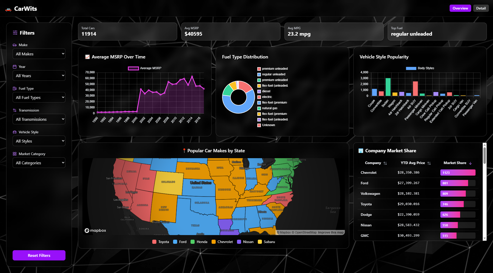
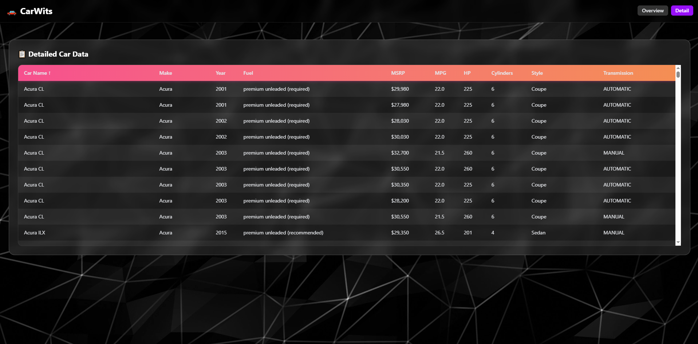

# CarWits

CarWits is an **interactive car data visualization dashboard** that lets users **explore, filter, and analyze car data through dynamic charts and tables**.  
Built for speed and clarity, CarWits leverages React and modern web tools to provide a smooth, data-driven experience.

---

## Live Demo
👉 [https://carwits.netlify.app/](https://carwits.netlify.app/)  

---

## Table of Contents
- [Features](#features)
- [Tech Stack](#tech-stack)
- [Screenshots](#screenshots)
- [Installation](#installation)
  - [Backend](#backend)
  - [Frontend](#frontend)
- [Usage](#usage)
- [API Overview](#api-overview)
  - [Cars](#cars)
  - [Charts](#charts)
  - [KPIs](#kpis)
- [Data Source](#data-source)

---

## Features

- 📊 **Interactive Charts & Graphs** — Explore car data through clean, animated visualizations  
- 🔎 **Advanced Filtering** — Filter cars by make, year, vehicle style, transmission, and other attributes  
- 📈 **Dynamic Dashboards** — Charts update in real time as filters are applied  
- 🌐 **Full-Stack Deployment** — Frontend on Netlify, backend on Railway for seamless integration

---

## Tech Stack

- **Frontend:** React (TypeScript), Tailwind CSS, Chart.js, Framer Motion  
- **Backend:** Node.js + Express (TypeScript)  
- **Database / Data Source:** JSON dataset converted from a Kaggle CSV  
- **Other:** Axios, Vite

---

## Screenshots

Here’s a preview of CarWits in action:

  


---

## Installation

> Note: The backend and frontend must be run separately. Start the backend first (`npm run dev` in `/backend`) and then the frontend (`npm run dev` in `/carwits`).

### Backend

1. Clone the repo:
   ```bash
   git clone https://github.com/JohnnyLe507/CarWits.git
   ```
2. Navigate to the backend:
   ```bash
    cd backend
    ```
3. Install dependencies:
   ```bash
    npm install
    ```
4. Then, create a `.env` file in the backend root with the following variables **(replace placeholder values with your actual secrets and credentials):**
   ```bash
    FRONTEND_URL=http://localhost:5173  # For local dev
    ```
5. Start the server:
   ```bash
    npm run devStart
    ```

### Frontend
1. Head back to the root and navigate to the frontend:
   ```bash
    cd ../carwits
    ```
2. Install dependencies:
   ```bash
    npm install
    ```
3. Create a `.env` file in /carwits with the following variable:
   ```bash
    VITE_API_BASE_URL=http://localhost:3000  # For local dev
    ```
4. Start the development server:
   ```bash
    npm run dev
    ```

### Usage
- Visit http://localhost:5173 for the frontend.
---

## API Overview
Base URL: `http://localhost:3000/api/cars`

### Cars
- **GET `/`**  
  Returns a filtered list of cars.  

  **Query Parameters (optional):**  
  - `make` – Car manufacturer  
  - `year` – Year of manufacture  
  - `fuelType` – Type of fuel  
  - `transmission` – Transmission type  
  - `style` – Vehicle body style  
  - `category` – Vehicle category  

  ✅ All filters accept `"All"` to bypass filtering.

---

### Charts
These endpoints return data formatted for charts (labels + datasets):

- **GET `/charts/fuel`**  
  Returns the distribution of cars by fuel type.

- **GET `/charts/styles`**  
  Returns the distribution of cars by body style.

- **GET `/charts/msrp`**  
  Returns the **average MSRP** grouped by year.

> All chart endpoints support the same filtering query parameters as `/`.

---

### KPIs
- **GET `/kpis`**  
  Returns key performance indicators for the current filtered dataset:
  - `totalCars`  
  - `avgMSRP`  
  - `avgMPG`  
  - `topFuel`

---

### Filter Options
- **GET `/options/:field`**  
  Returns unique values for a given field.  

  **Valid fields:**  
  - `make`  
  - `year`  
  - `fuelType`  
  - `transmission`  
  - `style`  
  - `category`

---

## Data Source

This project uses car data sourced from [Kaggle](https://www.kaggle.com/)  
Dataset: [Car Features and MSRP](https://www.kaggle.com/datasets/CooperUnion/cardataset)  
© The original dataset is provided by Cooper Union under the [CC BY 4.0 License](https://creativecommons.org/licenses/by/4.0/).
